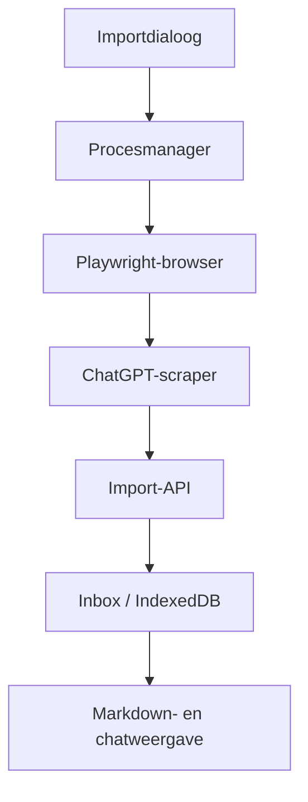

# Review ChatGPT bulk importer en voorbereiding Gemini bulk importer

## Hoofdconclusie

De wijzigingen van 11 juli vormen samen een bruikbare verticale keten:



De zwakste plekken zitten niet meer bij de basiswerking, maar bij procesbeheer, deduplicatie, chronologische betrouwbaarheid en de vermenging van generieke importlogica met ChatGPT-specifieke aannames. Dat laatste is belangrijk voordat Gemini bulk wordt toegevoegd.

## Belangrijkste bevindingen

### P0 — Processtatus kan onjuist worden

`chatgptImportManager.js` zet `importProcess = null` onmiddellijk in `stopBulkImport()`. Het proces en Chrome kunnen dan nog bezig zijn met afsluiten, terwijl de UI alweer een nieuwe import mag starten.

Mogelijke gevolgen:

- twee Python-processen of browserprofielen tegelijk;
- een nieuw proces opent hetzelfde persistente profiel terwijl het oude nog afsluit;
- `exit` van het oude proces kan daarna `importProcess = null` zetten terwijl het nieuwe proces al draait;
- Stop → direct Start levert moeilijk reproduceerbare statusfouten op.

De Hermes-manager heeft vergelijkbare lifecycle-problemen opgelost met opruimen van PID én poort, maar de importer heeft die safeguards niet overgenomen. Het commentaar “same as Hermes” suggereert meer gedeelde robuustheid dan werkelijk aanwezig is.

**Aanbevolen vóór Gemini:** maak één generieke process-runner met toestanden `starting`, `running`, `stopping`, `exited`, plus een unieke run-id. Alleen de exit-handler van de actieve run mag de status wijzigen.

### P0 — Stoppen op Linux/macOS doodt waarschijnlijk niet de browserboom

Op Windows wordt `taskkill /t` gebruikt. Op andere platforms alleen:

```js
importProcess.kill("SIGTERM")
```

Playwright/Chrome kan als zelfstandig childproces blijven leven. Daardoor kan het profiel gelockt blijven en kan een volgende run mislukken.

Hermes gebruikt inmiddels expliciet opruimen op proces/poort omdat alleen de wrapper-PID onvoldoende bleek. De importer herhaalt dus gedeeltelijk hetzelfde probleem.

**Safeguard:** start het importproces in een eigen process group/session en beëindig de hele groep. Controleer na afloop dat browserkinderen weg zijn en het profiel opnieuw geopend kan worden.

### P0 — Deduplicatie op volledige berichttekst kan echte herhaling verwijderen

Zowel de extensie als bulk importer dedupliceren met:

```text
role + volledige tekst/HTML
```

Wanneer iemand twee keer exact “ja” zegt, of een assistant exact hetzelfde antwoord herhaalt, blijft maar één turn over. Virtualisatie wordt hiermee onderdrukt, maar semantisch geldige duplicaten verdwijnen.

Dit kan ook de volgorde aantasten als twee identieke berichten in verschillende delen van een lange chat staan.

**Voor Gemini essentieel:** gebruik waar mogelijk provider-message-id. Als die ontbreekt, gebruik een positionele fingerprint, bijvoorbeeld rol + teksthash + naburige turn + scrollsegment. Dedupliceer alleen overlappende snapshots, niet de gehele conversatie globaal.

### P1 — Chatweergave herkent alleen paragrafen die letterlijk met `H: ` of `A: ` beginnen

De renderer inspecteert alleen het eerste tekstkind van een Markdown-paragraaf. Hierdoor werkt de chatbubble niet betrouwbaar als een turn begint met een heading, code fence, blockquote, lijst, afbeelding, inline opmaak of een nieuwe providerprefix zoals `G:`.

Bovendien kan een gewone notitie die toevallig een paragraaf met `A: ` begint als AI-chatbubble verschijnen. De renderer kijkt niet naar `object.type`, `sourceProvider` of het gestructureerde `turns`-veld.

**Aanbevolen:** render chats rechtstreeks vanuit `object.turns`. Gebruik `content` alleen als leesbare/exporteerbare afgeleide. Daarmee hoeft Gemini geen tekstprefix-conventie te erven.

### P1 — Markdown preview is nu standaard voor ieder niet-leeg object

De previewstatus wordt gebaseerd op:

```js
!!(object.title || object.content)
```

Een nieuw object met alleen een automatisch ingevulde titel opent daardoor in preview, ook als de inhoud nog leeg is. Dat kan het “direct schrijven”-gedrag breken.

Ook schakelt Enter in de titel preview uit, zelfs bij een gelockt object. De textarea is dan vermoedelijk disabled, waardoor de gebruiker visueel in editmodus belandt zonder te kunnen typen.

### P1 — `occurredAt` is het tijdstip van de laatste gevonden datumgroep

De scraper loopt van boven naar beneden en bewaart de laatste separator. Daardoor betekent `occurredAt` feitelijk “tijdstip rond het meest recente bericht”.

Dat is verdedigbaar, maar:

- de sortering verschuift zodra een oude chat later wordt hervat;
- een gedeeltelijk geladen laatste separator kan een verkeerde datum geven;
- de labelparser ondersteunt vooral Nederlands en Engels;
- een weekdag zonder datum wordt altijd geïnterpreteerd als de meest recente weekdag;
- datumlabels rond jaarwisseling kunnen in het verkeerde jaar vallen.

Voor Gemini zal de tijdsbron waarschijnlijk anders zijn. Maak daarom expliciet onderscheid tussen `createdAt`, `lastMessageAt`, `importedAt` en eventueel `providerUpdatedAt`.

### P1 — Importstatus is lokaal aan de importer, niet aan Chronicle

`imported.json` bevat URLs die volgens die ene lokale installatie al verwerkt zijn. Dit beschermt niet tegen:

- verwijderen van `imported.json`;
- gewijzigde of canonieke URL’s;
- duplicaten vanuit de browserextensie;
- dezelfde chat via een andere importer;
- opnieuw importeren na een gedeeltelijk mislukte serverclaim;
- Gemini-links met queryparameters of share-URL’s.

Een HTTP 201 betekent bovendien alleen dat Chronicle de import heeft aangenomen, niet noodzakelijk dat de frontend hem succesvol uit de inbox heeft geclaimd en opgeslagen.

**Aanbevolen:** server-side idempotency op `(sourceProvider, providerConversationId)`, eventueel aangevuld met contentversie of laatste bericht-id.

### P1 — Startparameters worden onvoldoende gevalideerd

De route geeft `limit` en `headless` vrijwel rechtstreeks door. Negatieve of niet-numerieke limits, extreem grote waarden en stringwaarden zoals `"false"` kunnen onverwacht gedrag geven. Ook ontbreken preflightchecks voor Python, dependencies, het script, token en API-adres.

`spawn()` kan aanvankelijk als gestart worden gerapporteerd en pas daarna via `error` mislukken. De frontend krijgt dan eerst succes.

### P2 — Overige risico’s

- Logregels worden per streamchunk gesplitst, zonder restbuffer. Eén regel kan als twee regels verschijnen.
- De scraper heeft harde bovengrenzen van 60, 500 en 300 scrollpogingen zonder een `incomplete` resultaat te melden.
- Automatiseringsverhulling met `navigator.webdriver` is fragiel en geen stabiele authenticatiestrategie.

# Geprioriteerde handmatige testchecklist

## P0 — Eerst uitvoeren

### Procesbeheer

- [ ] Start een import met `limit=3`; controleer dat precies één Pythonproces en één browserboom bestaan.
- [ ] Klik twee keer snel op Start; de tweede aanvraag moet 409 geven en geen tweede browser openen.
- [ ] Klik Stop en onmiddellijk Start; de nieuwe run mag pas beginnen nadat de oude browserboom werkelijk weg is.
- [ ] Stop tijdens login, sidebar-scannen, midden in een chat en tijdens POST naar Chronicle.
- [ ] Sluit Chronicle/server hard af tijdens een import; start opnieuw en controleer op achtergebleven Python- en Chrome-processen.
- [ ] Forceer een Pythoncrash; Chronicle zelf moet blijven draaien en de UI moet `running=false` tonen.
- [ ] Forceer een stdout/stderr-streamfout; geen servercrash.
- [ ] Start tegelijk Hermes en een bulkimport; controleer dat processtatussen en logs niet door elkaar raken.
- [ ] Herstart Chronicle terwijl Hermes al op poort 9120 draait; controleer dat slechts het bedoelde proces wordt beëindigd.
- [ ] Zet tijdelijk een ander programma op poort 9120; controleer of Chronicle dit zonder waarschuwing doodt. Dit is een gevaarlijke ontbrekende ownership-check.

### Datavolledigheid

- [ ] Importeer een lange, gevirtualiseerde chat en vergelijk aantal en volgorde van turns met ChatGPT.
- [ ] Gebruik een chat waarin exact hetzelfde korte bericht meerdere keren voorkomt, bijvoorbeeld drie keer `ja`.
- [ ] Gebruik identieke assistant-antwoorden op verschillende posities.
- [ ] Gebruik één extreem lang bericht of codeblok dat meerdere schermhoogtes beslaat.
- [ ] Controleer dat het eerste én laatste bericht aanwezig zijn.
- [ ] Controleer dat een afgebroken walk niet als definitief geïmporteerd wordt gemarkeerd.

### Idempotentie

- [ ] Importeer dezelfde chat eerst via de extensie en daarna via bulk.
- [ ] Voer bulk tweemaal uit met dezelfde `imported.json`.
- [ ] Verwijder of hernoem `imported.json` en voer opnieuw uit.
- [ ] Test dezelfde URL met querystring, trailing slash en andere hostvariant.
- [ ] Stop nadat de server 201 heeft gegeven maar vóór lokale state-save; hervat en controleer duplicaten.

## P1 — Daarna uitvoeren

### Login en browserprofiel

- [ ] Eerste run zonder login via email/wachtwoord.
- [ ] Google OAuth-route.
- [ ] Login met meerdere navigaties en redirects.
- [ ] 2FA- of passkey-flow.
- [ ] Verlopen sessie in bestaand profiel.
- [ ] Profiel is al geopend in Chrome.
- [ ] Browser wordt handmatig gesloten terwijl de import wacht.
- [ ] Login duurt langer dan de timeout; foutmelding moet uitlegbaar zijn.
- [ ] Playwright Chrome-channel ontbreekt; fallback werkt.
- [ ] Python, Playwright of `markdownify` ontbreekt; UI toont een concrete preflightfout.

### Scraping en tijd

- [ ] ChatGPT-interface in Nederlands en Engels.
- [ ] Separator met Vandaag/Gisteren.
- [ ] Weekdaglabel.
- [ ] Volledige datum met en zonder jaar.
- [ ] Chat rond zondag/maandag en 31 december/1 januari.
- [ ] Chat zonder separator; `occurredAt` moet leeg of expliciet fallback zijn.
- [ ] Oude chat die vandaag opnieuw is hervat; bepaal of sortering op laatste activiteit gewenst is.
- [ ] Sidebar met gearchiveerde chats, projecten, GPT-chats en tijdelijke chats.
- [ ] Sidebar die pas na langdurig scrollen meer gesprekken laadt.
- [ ] Verwijderde of ontoegankelijke chat tussen linkverzameling en openen.

### Markdown en chatweergave

- [ ] Turn begint met gewone tekst.
- [ ] Turn begint met heading, lijst, quote, tabel, code fence en afbeelding.
- [ ] Inline vet of cursief direct na `H:` of `A:`.
- [ ] Code met tekst die zelf `H:` of `A:` bevat.
- [ ] Gewone notitie met een paragraaf die toevallig `A: ` begint; geen chatbubble.
- [ ] Links met gevaarlijke of ongebruikelijke schema’s.
- [ ] Zeer lange regels, brede tabellen en codeblokken op smalle en brede layouts.
- [ ] Wissel Preview/Edit snel en selecteer direct daarna een ander object.
- [ ] Open een object met alleen een titel en lege content.
- [ ] Open een gelockt object en druk Enter in de titel.
- [ ] Controleer dat ruwe Markdown na bewerken niet ongemerkt wordt herschreven.

## P2 — Robuustheid en UX

- [ ] `limit`: leeg, 0, negatief, decimaal, tekst en zeer groot.
- [ ] `headless`: echte boolean versus string `"false"`.
- [ ] Chronicle-server tijdelijk onbereikbaar: retries en voortgang.
- [ ] HTTP 401, 413, 429, 500 en socket timeout.
- [ ] Eén mislukte chat mag de rest niet stoppen.
- [ ] Logbuffer boven 500 regels; nieuwste regels blijven zichtbaar.
- [ ] Zeer lange logregel en Unicode/emoji.
- [ ] Dialoog openen op een lang gescrolde pagina; hij blijft gecentreerd.
- [ ] Dialoog sluiten terwijl import doorloopt; opnieuw openen herstelt status en log.
- [ ] Meerdere Chronicle-vensters tegelijk; beide tonen consistente runstatus.

# Voorbereiding Gemini bulk importer

Maak geen tweede kopie van `bulk_import.py`. Splits eerst de huidige implementatie in vier lagen:

| Laag | Generiek | Provider-specifiek |
|---|---|---|
| Procesrunner | lifecycle, stop, logs, preflight | Python executable en profiel |
| Browser session | persistent context, loginwait, navigatiefouten | loginherkenning per provider |
| Scraper | scrollwalk, snapshot merging, attachments | selectors, rollen, conversation-id en timestamps |
| Chronicle transport | auth, retries, idempotency en payload | `sourceProvider` |

Een provider-interface moet minimaal leveren:

```text
provider
canonicalConversationId
canonicalUrl
title
turns[]
createdAt?
lastMessageAt?
attachments[]
complete
warnings[]
```

Voor Gemini specifiek handmatig onderzoeken:

- sidebar-linkstructuur en stabiele conversation-id;
- custom elements zoals `user-query`, `model-response` en `message-content`;
- branches of regenerations van antwoorden;
- citations en source cards;
- generated images en geüploade bestanden;
- codeblokken, tabellen en mathematical rendering;
- Gems versus gewone Gemini-chats;
- Google-accountwissel en meerdere profielen;
- datum- en tijdbron;
- virtualisatiegedrag;
- URL-canonicalisatie.

De bestaande extensie bevat al Gemini-selectors, maar die zijn slechts een startpunt. `leavesOnly()` voorkomt nested duplicates, terwijl globale content-deduplicatie nog steeds echte herhalingen kan verwijderen.

## Aanbevolen implementatievolgorde

1. Procesmanager lifecycle veilig maken.
2. Server-side provider-idempotency toevoegen.
3. Chatweergave op gestructureerde `turns` baseren.
4. Scrapercontract en provideradapter introduceren.
5. ChatGPT-importer naar die adapter migreren en de P0-tests herhalen.
6. Daarna `GeminiProvider` toevoegen.
7. Eerst `limit=3`, daarna een set met lange chats, bronnen, afbeeldingen en herhaalde korte antwoorden.

## Bekeken kerncommits

- [ChatGPT bulk importer](https://github.com/Bojanni050/Foundation-Chronicle/commit/28c01456cb392715b106c7fc3d8c828c057bbfdd)
- [UI-process control](https://github.com/Bojanni050/Foundation-Chronicle/commit/d62ebd6f6ea7812117a7d611715da801007e4dc7)
- [Login handling](https://github.com/Bojanni050/Foundation-Chronicle/commit/23a2298cba6191757fa0d308b02fd821925bcddc)
- [Date scraping](https://github.com/Bojanni050/Foundation-Chronicle/commit/c31f62b0c94c62b91fa6005e014bb3b0bc844257)
- [Markdown preview](https://github.com/Bojanni050/Foundation-Chronicle/commit/5b7780ab67c7f20cf7d6d40ded079fb707ed55c1)
- [Chat rendering](https://github.com/Bojanni050/Foundation-Chronicle/commit/87a5b80dd2a97d47c4ecc586ce68744a2acca5ee)
- [Hermes orphan cleanup](https://github.com/Bojanni050/Foundation-Chronicle/commit/3c7c8d77a36aaaf1696b61b7aa50ad48c20f85dd)
